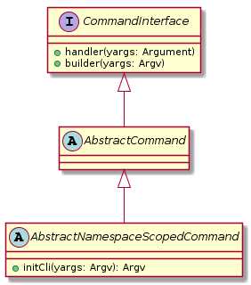
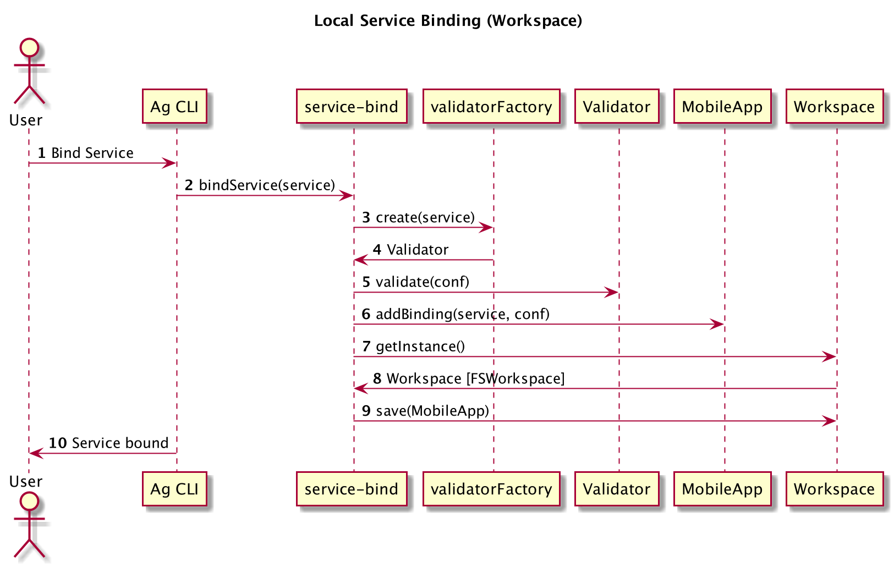

# Adding new CLI commands

The AG-CLI command line tool uses `yargs` for parsing the command line, however it adds a small layer of abstraction 
composed by a couple of classes.

Each command must have its own file into the `cmds` folder and must implement the `CommandInterface` interface.



Two utility class are provided to make it easier:
* AbstractCommand : an abstract class providing basic functionalities
* AbstractNamespaceScopedCommand: a base class that automatically provides the `-n|--namespace` parameters to the command line

Since most of the commands are namsepace scoped, the second class is the most used one.

## The service bind command
The most complex command is the bind command, so it can worth dig into it a bit


1. The user invokes the `service bind` command on the command line
2. The cli invokes the `service bind` command handler
3. The `service bind` command handler asks to the `ValidatorFactory` to create a `Validator` for the requested service
4. The `ValidatorFactory` returns a validator that can validate the configuration for the requested service
5. The `service bind` handler asks the validator if the provided configuration is valid
6. If the configuration is valid, the new binding is added to the MobileApp object
7. The `service bind` handler retrieves an instance of the `Workspace`
8. A file system implementation is returned (`FSWorkspace`)
9. `service bind` asks the `Workspace` to persist the `MobileApp`
10. Service has been bound message is returned to the user
 
## Validators

Some command (like for example the `bind` command) could require some sort of configuration as parameter. Such
configuration can be validated by configuring the validator and invoking the validation with the following code:

```typescript
    const validator: Validator = ValidatorFactory.create('serviceType');
    const res = validator.validate(myJsonData);
    if (res.valid) {
       // do some stuff
    } else {
      console.log(`field ${res.field} is not valid: ${res.message}`);
    }
```

When the `ValidatorFactory.create` method is invoked, it works this way:
1. If a file called `${serviceType}-validator.json` exists into the `$HOME/.ag` folder, that file is loaded and used to configure the validator
2. If a default configuration exists for the provided service, that configuration is used for configuring the validator
3. If none of the above are successful, no validator is returned.

### Example validator configurations
**DataSync service validator configuration**
```typescript
export const conf: ValidatorConfig = {
  ruleSets: [
    {
      fields: {
        syncServerUrl: [
          {
            type: 'REQUIRED',
          },
          {
            type: 'VALID_URL',
          },
        ],
        graphqlEndpoint: [
          {
            type: 'REQUIRED',
          },
          {
            type: 'VALID_URL_PATH',
          },
        ],
      },
    },
  ],
};
```

**Push service validator configuration**
```typescript
export const conf: ValidatorConfig = {
  ruleSets: [
    {
      fields: {
        variant: [
          {
            type: 'REQUIRED',
            errorMessage:
              'Bad service configuration - variant field is required',
          },
          {
            type: 'COMPOSITE',
            algorithm: 'any',
            errorMessage: `Bad service configuration - variant can be either 'ios' or 'android'`,
            subRules: [
              {
                type: 'EXACT_VALUE',
                value: 'android',
              },
              {
                type: 'EXACT_VALUE',
                value: 'ios',
              },
            ],
          },
        ],
      },
    },
    {
      constraints: [
        {
          type: 'FIELD_VALUE',
          path: 'variant',
          value: 'android',
        },
      ],
      fields: {
        serverKey: [
          {
            type: 'REQUIRED',
            errorMessage: 'Bad service configuration - serverKey is required',
          },
        ],
        senderId: [
          {
            type: 'REQUIRED',
            errorMessage: 'Bad service configuration - senderId is required',
          },
        ],
      },
    },
  ],
};
```

## The binding command

If adding a new service, it will be useful to know how the binding process works to be able to add the pieces of code in the right place.


## Example command
```typescript
class MyGreatCommand extends AbstractNamespaceScopedCommand {
  constructor() {
    super('gen', 'Generates/updates the mobile-services.json file');
  }

  protected initCli(yargs: Argv): Argv<any> {
    return yargs
      .positional('param1', {
        describe: 'an example positional parameter',
        type: 'string',
      })
      .option('option1', {
        alias: 'o',
        type: 'boolean',
        describe:
          'An example boolean option taking no arguments',
        nargs: 0,
      });
  }

  public handler = async (yargs: Arguments) => {
    console.log('MyGreatCommand called');
  };
}

// call the expose function passing your new command to expose the command to yargs
expose(new AppGenCommand(), module);
```