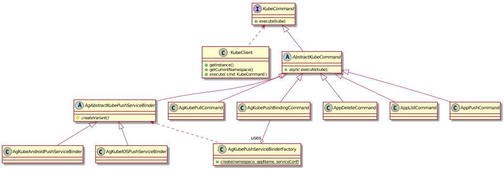
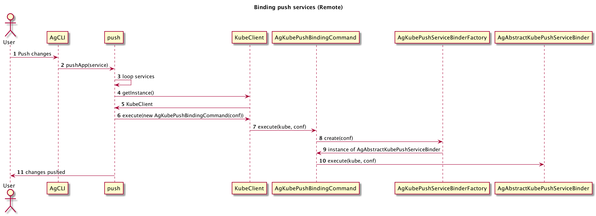

# The KUBE commands

All of the interactions with the Openshift cluster happens throught the `KubeCLient` component. That component
uses the command pattern so that it is very easy to add new components.



Each command must implements the `KubeCommand` interface. An utility class (`AbstractKubeCommand`) is provided to reduce
the effort needed.

Provided commands are:
* `AgKubePushBindingCommand` : this is a generic _push binder_: it receives the configuration for the service binding in the form of
   ```json
   { "variant": "ios|android",
     "key" : "value"
   }
   ```
  where _key_ and _value_ are configuration keys for the _android_ or _ios_ binding.
  According to the value of the _variant_ key, `AgKubePushBindingCommand` will decide who will do the real binding 
  (delegation pattern): `AgKubeAndroidPushServiceBinder` or `AgKubeAndroidIOSServiceBinder`
* `AgKubePullCommand` : downloads a mobileclient definition from the openshift cluster
* `AppDeleteCommand`: deletes an mobileclient from the cluster
* `AppListCommand`: lists the applications in the clister
* `AppPushCommand`: pushes the changes done locally to an application to the cluster

## The AgKubePushBindingCommand

It may be worth spending some time digging into the `AgKubePushBindingCommand` as it is the most complex command.
Unlike the others, binding the push service is not a matter of just creating one custom resoucer, but involves a whole flow:
1. Check if a push application already exists: if it doesn't, create it, otherwise use it
2. Wait for the push application to be ready (we need to have the `push application id` ready)
3. Create the custom resource for the desired variant (android, ios, webpush, etc.).

Below the sequence diagram of the push binding

